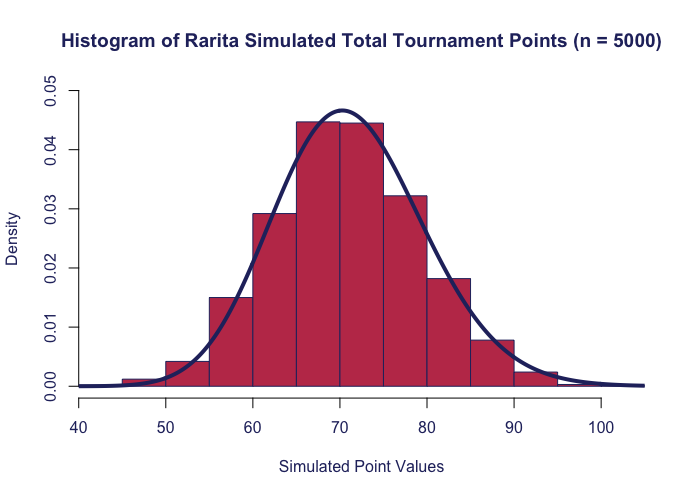

On behalf of the Comissioner of Sport for Rarita, Team A has constructed the inaugural Raritan football team! 

This page outlines the statistical methodologies and analysis undertaken to support the team recommendation. 

---

| Player | Position|
| :---:  | :---:  |
| K. Kazlo? | FW |
| A. Kyarikunda | FW |
| U. Shoko | FW |
| W. Martinez | FW |
| P. Rabiu | MFFW |
| P. Villa | MFFW |
| Q. Morrison | MF |
| J. Nurhayati | MF |
| X. Leroy | MF |
| S. Barman | MF |
| O. Wanjala | MF |
| F. Chin | MF |
| H. Zare | DF |
| C. Tukamushaba | DF |
| H. Azizi | DF |
| N. Terzi? | DF |
| T. Nouri | DF |
| A. Omar | GK |
| B. Ampofo | GK |

The above 20 players were chosen from three separate logistic GLM models, applied to three groups of players:				
				
- Tournament Forwards – Shooting and Passing metrics for 2021
- Tournament Defenders – Defending and Passing metrics for 2021
- Tournament Goalkeepers – Goalkeeping metrics for 2021

The model was designed to both select and provide weights for each of the metrics depending on their significance in predicting tournament success for each of the three groups of players. Tournament success was defined as placing in the top 3 teams in the 2021 FSA Tournament. 
		 	 	 		
			
Specific metrics were then manually adjusted where deemed necessary, in particular when some variables were assigned negative coefficients.  Then, from the top Raritan candidates ranked by the models, the final team selection was made. 

### Team Competitiveness
		 	 	 		
We’ve developed an estimate of the winning probabilities for each matchup of the 2021 FSA tournament, calculated by merging key team performance metrics: 

| Result | Calculation |
| :---:  | :---:  |
| Win | Sum of Goalkeeper 'W', opponent Goalkeeper 'L', Total xG, opponent Total GA |
| Draw | Sum of Goalkeeper 'D', opponent Goalkeeper 'D', Absolute Difference between Total xG and Total GA, Opponents Absolute Difference between Total xG and Total GA|
| Loss | Sum of Goalkeeper 'L', opponent Goalkeeper 'W', Total GA, opponent Total xG |

So then the probability of a win will be this 'Win' metric divided by the sum of all 3 'Win', 'Draw' and 'Loss' metrics.

From these probabilities, the teams’ expected number of tournament points across a season (home and away) were calculated. (3 for a Win, 1 for a Draw, 0 for a Loss). The expected points table alligns quite well with the 2021 Tournament results, demonstrating the validity of this using this approach for estimating Tournament Results.

Monte Carlo simulation was then used to simulate the tournament points earned throughout a theoretical season for our recommended Raritan national team, and the highest and lowest placing nations from the 2021 RFA tournament for comparison.

### Congrats on completing the [2022 SOA Research Challenge](https://www.soa.org/research/opportunities/2022-student-research-case-study-challenge/)!

>Now it's time to build your own website to showcase your work.  
>To create a website on GitHub Pages to showcase your work is very easy.

This is written in markdown language. 
>
* Click [4001 link](https://classroom.github.com/a/ggiq0YzO) to accept your group assignment.
* Click [5100 link](https://classroom.github.com/a/uVytCqDv) to accept your group assignment 

#### Follow the [guide doc](Doc1.pdf) to submit your work. 
---
>Be creative! Feel free to link to embed your [data](player_data_salaries_2020.csv), [code](sample-data-clean.ipynb), [image](ACC.png) here

More information on GitHub Pages can be found [here](https://pages.github.com/)

