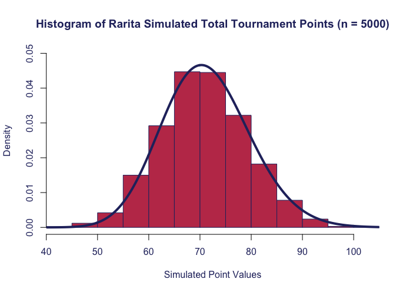

On behalf of the Comissioner of Sport for Rarita, Team A has constructed the inaugural Raritan football team! 

This page outlines the statistical methodologies and analysis undertaken to support the team recommendation. 

---

| Player | Position|
| :---:  | :---:  |
| K. Kazlo?  | FW |
| A. Kyarikunda | FW |
| U. Shoko | FW |
| W. Martinez | FW |
| P. Rabiu | MFFW |
| P. Villa | MFFW |
| Q. Morrison | MF |
| J. Nurhayati | MF |
| X. Leroy | MF |
| S. Barman | MF |
| O. Wanjala | MF |
| F. Chin | MF |
| H. Zare | DF |
| C. Tukamushaba | DF |
| H. Azizi | DF |
| N. Terzi? | DF |
| T. Nouri | DF |
| A. Omar | GK |
| B. Ampofo | GK |

The above 20 players were chosen from three separate logistic GLM models, applied to three groups of players:				
				
- Tournament Forwards – Shooting and Passing metrics for 2021
- Tournament Defenders – Defending and Passing metrics for 2021
- Tournament Goalkeepers – Goalkeeping metrics for 2021

The model was designed to both select and provide weights for each of the metrics depending on their significance in predicting tournament success for each of the three groups of players. Tournament success was defined as placing in the top 3 teams in the 2021 FSA Tournament. 
		 	 	 		
			
Specific metrics were then manually adjusted where deemed necessary, in particular when some variables were assigned negative coefficients.  Then, from the top Raritan candidates ranked by the models, the final team selection was made. 

		 	 	 		
We’ve developed an estimate of the winning probabilities for each matchup of the 2021 FSA tournament, calculated by merging key team performance metrics: 

| Result | Calculation |
| :---:  | :---:  |
| Win | Sum of Goalkeeper 'W', opponent Goalkeeper 'L', Total xG, opponent Total GA |
| Draw | Sum of Goalkeeper 'D', opponent Goalkeeper 'D', Absolute Difference between Total xG and Total GA, Opponents Absolute Difference between Total xG and Total GA|
| Loss | Sum of Goalkeeper 'L', opponent Goalkeeper 'W', Total GA, opponent Total xG |

So then the probability of a win will be this 'Win' metric divided by the sum of all 3 'Win', 'Draw' and 'Loss' metrics.

From these probabilities, the teams’ expected number of tournament points across a season (home and away) were calculated. (3 for a Win, 1 for a Draw, 0 for a Loss). The expected points table alligns quite well with the 2021 Tournament results, demonstrating the validity of this using this approach for predicting Tournament Results. Many of the teams have a total quite close to each other, so some discrepancy is expected.

| 2021 FSA Tournament Placement | Nations ordered by Expected Tournament Points | Expected Tournament Points |
| :---:  | :---:  | :---:  |
| Sobianitedrucy | Sobianitedrucy| 80.39256|
| People's Land of Maneau | Nganion |77.57156|
| Nganion | People's Land of Maneau |75.75966|
| Mico | Byasier Pujan |74.79793|
| Quewenia | Rarita |74.66649|
| Southern Ristan | Greri Landmoslands |73.42093|
| Galamily | Djipines |71.63178|
| Bernepamar | Giumle Lizeibon |69.43081|
| Giumle Lizeibon | Southern Ristan |69.12867|
| Greri Landmoslands | Manlisgamncent |68.40061|
| Xikong | Mico |64.96052|
| Manlisgamncent | Ngoque Blicri |64.82188|
| Esia | Bernepamar |63.32280|
| Byasier Pujan | Galamily |62.73767|
| Djipines | Leoneku Guidisia |61.85567|
| Leoneku Guidisia | Xikong |60.79721|
| Ledian | Quewenia |58.76166|
| Eastern Sleboube | New Uwi |57.54362|
| New Uwi | Nkasland Cronestan |56.26734|
| Ngoque Blicri | Esia |52.72160|
| Nkasland Cronestan | Eastern Niasland |51.88768|
| Eastern Niasland | Varijitri Isles |47.44720|
| Varijitri Isles | Ledian |46.41649|
|  | Eastern Sleboube |40.63047|

Monte Carlo simulation was then used to simulate the tournament points earned throughout a theoretical season for our recommended Raritan national team, and the highest and lowest placing nations from the 2021 RFA tournament for comparison. Fitting a gamma distribution to these results allows us to compute an estimated probability of achieving a top 10 placement (estimated by achieving greater than 65 tournament points), and a tournament title (estimated by achieving 85 points).

Economic Impacts <- format 

World Cup Data 

Data from the world cup was used to model the GDP growth of Rarita since the World Cup was the largest soccer tournament in the world where teams could represent their home countries on the international level.

	

|*Countries*|*t-2*	|*t-1*	|*t*	|*t+1*	|*t+2*|
| :---:  | :---:  | :---:  | :---:  | :---:  | :---:  |
|Brazil (1970)	|10%	|10%	|10%	|11%	|12%|
|West Germany (1974)	|4%	|5%	|1%	|-1%	|5%|
|Argentina (1978)	|-2%	|7%	|-5%	|10%	|2%
|Italy (1982)	|3%	|1%	|0%	|1%	|3%|
|Argentina (1986)	|2%	|-5%	|6%	|3%	|-1%|
|West Germany (1990)	|4%	|4%	|3%	|5%	|2%|
|Brazil(1994)	|1%	|-3%	|6%	|8%	|7%|
|France (1998)	|1%	|2%	|4%	|3%	|4%|
|Brazil (2002)	|4%	|1%	|4%	|1%	|6%|
|Italy (2006)	|1%	|1%	|2%	|1%	|-1%|
|Spain (2010)	|1%	|-4%	|0%	|-1%	|-3%|
|Germany (2014)	|0%	|0%	|2%	|1%	|2%|
|France (2018)	|1%	|2%	|2%	|2%	|-8%|

### Congrats on completing the [2022 SOA Research Challenge](https://www.soa.org/research/opportunities/2022-student-research-case-study-challenge/)!

>Now it's time to build your own website to showcase your work.  
>To create a website on GitHub Pages to showcase your work is very easy.

This is written in markdown language. 
>
* Click [4001 link](https://classroom.github.com/a/ggiq0YzO) to accept your group assignment.
* Click [5100 link](https://classroom.github.com/a/uVytCqDv) to accept your group assignment 

#### Follow the [guide doc](Doc1.pdf) to submit your work. 
---
>Be creative! Feel free to link to embed your [data](player_data_salaries_2020.csv), [code](sample-data-clean.ipynb), [image](ACC.png) here

More information on GitHub Pages can be found [here](https://pages.github.com/)

